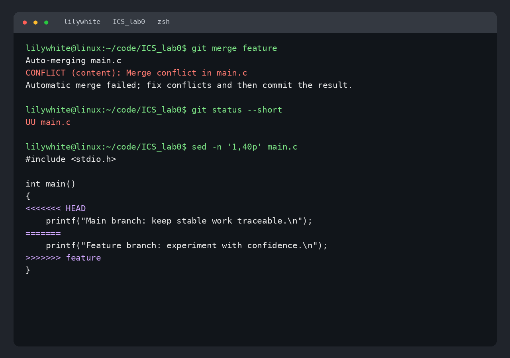
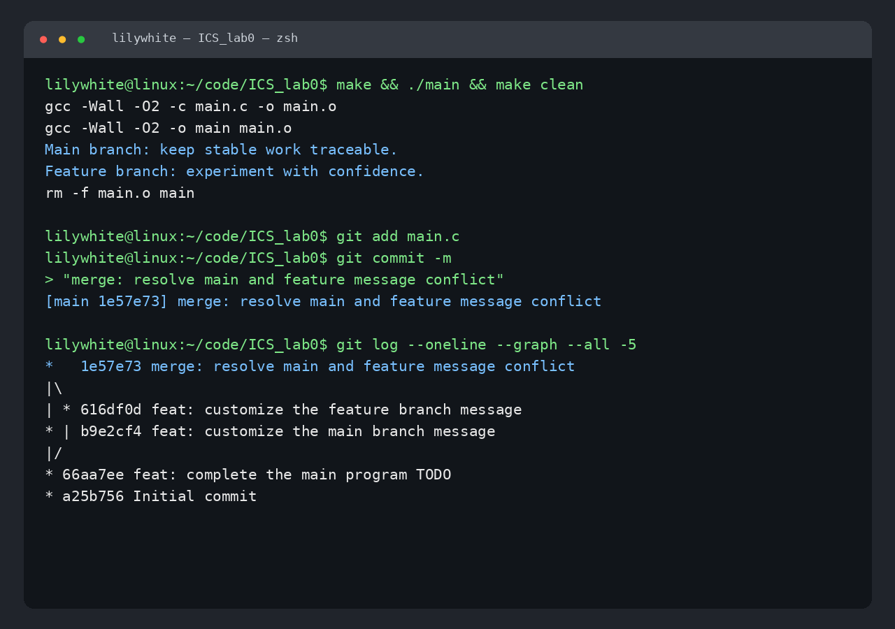

# Lab0：GitLab 实验报告

- GitHub：`ACAne047`
- 仓库：[ACAne047/ICS_lab0](https://github.com/ACAne047/ICS_lab0)
- 实验环境：Linux、Git 2.53.0、GCC 15.2.0

## 一、文档问题

### 1. 多人协同开发经历与分工方式

此前我参与正式多人协同开发的经验较少。对于小型协作项目，我会先约定模块接口，再按功能或文件分工；每个人从稳定分支创建自己的功能分支，在功能完成后提交并合并回主分支。协作时还应通过 Issue、Pull Request 或即时通信说明任务范围和接口变化，并在合并前进行代码检查。这样可以减少多人同时修改同一位置导致的冲突，也能清楚记录每项改动的作者和原因。

### 2. Git 为什么设计“暂存—提交”两个步骤

工作区中的修改不一定属于同一个目的。暂存区让开发者先从所有修改中挑选出准备纳入本次提交的部分，并在提交前用 `git diff --staged` 再次检查。这样可以把一次混合修改拆成若干个主题明确、可独立回退的原子提交，也可以暂时保留尚未完成的工作。因此，“暂存—提交”把“正在编辑的内容”和“希望永久记录的版本”分离开来，提高了提交历史的可读性与可维护性。

### 3. `git branch` 和 `git branch -a` 的区别

- `git branch` 默认只列出本地分支，并用 `*` 标出当前分支。
- `git branch -a` 列出所有可见分支，包括本地分支和远程跟踪分支（例如 `remotes/origin/main`）。

补充来说，`git branch -r` 只列出远程跟踪分支。远程跟踪分支是本地对远端状态的记录，并不等同于可直接编辑的本地分支。

## 二、选读材料与思考

### 1. [Commit message 和 Change log 编写指南](https://www.ruanyifeng.com/blog/2016/01/commit_message_change_log.html)

文章介绍了结构化提交信息的价值和 Angular 风格的提交格式。提交信息由必需的 Header 以及可选的 Body、Footer 组成；Header 中包含 `type`、可选的 `scope` 和简短的 `subject`。`feat`、`fix`、`docs`、`refactor` 等类型能直接表达改动性质。规范的提交信息便于浏览和筛选历史，也能关联 Issue、标记不兼容变更，并自动生成 Change Log。本实验的提交信息也使用了类似的类型前缀。

### 2. [语义化版本 2.0.0](https://semver.org/lang/zh-CN/)

语义化版本使用 `主版本号.次版本号.修订号`，即 `MAJOR.MINOR.PATCH`。不兼容的 API 变化增加主版本号，向后兼容的新功能增加次版本号，向后兼容的问题修复增加修订号；还可以附加预发布标识和构建元数据。它的前提是项目先定义清晰的公共 API，然后用版本号向使用者传递兼容性信息，从而减少“升级是否安全”的沟通成本。

### 3. 为什么要学习 Git

Git 不只是代码备份工具，更是一种组织开发过程的方法。提交历史能记录变化和原因，分支让新功能或实验与稳定版本隔离，合并机制支持多人并行开发，标签和提交哈希则让构建结果能够追溯。结合规范的提交信息和语义化版本，Git 还能连接代码审查、测试、发布和回退流程。学习 Git 可以降低试错成本，让个人开发更有条理，也为参与团队项目和开源协作打下基础。

## 三、实验步骤

1. 检查 Git 和 GitHub CLI 配置，确认提交用户名、邮箱及 GitHub 登录状态。
2. 使用课程模板仓库 `ICS-26Fall-FDU/GitLab` 创建个人公开仓库 `ACAne047/ICS_lab0`，并克隆到本地。
3. 修改 `main.c`，完成 TODO；执行 `make`、`./main` 和 `make clean` 验证程序，然后提交：

   ```text
   66aa7ee feat: complete the main program TODO
   ```

4. 从该提交创建 `feature` 分支，修改 `printf` 所在行并提交：

   ```text
   616df0d feat: customize the feature branch message
   ```

5. 切换回 `main`，修改同一行但写入不同内容并提交：

   ```text
   b9e2cf4 feat: customize the main branch message
   ```

6. 在 `main` 执行 `git merge feature`。两个分支修改了同一文件的同一行，Git 无法自动判断应保留哪一侧，因而产生内容冲突。

   

7. 编辑 `main.c`，删除 `<<<<<<<`、`=======` 和 `>>>>>>>` 冲突标记，并保留两条有意义的输出；重新编译运行后暂存文件并创建合并提交：

   ```text
   1e57e73 merge: resolve main and feature message conflict
   ```

   下图中程序能够成功编译运行，提交图也显示 `main` 与 `feature` 的两条历史已经汇入合并提交，说明冲突已解决。

   

8. 编写本实验报告，在 `main` 分支提交报告和截图；最后推送 `main` 与 `feature` 分支到 GitHub。

## 四、实验结果

最终程序输出如下：

```text
Main branch: keep stable work traceable.
Feature branch: experiment with confidence.
```

`main` 分支包含 TODO 修改、两个分支各自的修改、冲突解决产生的合并提交以及实验报告；`feature` 分支保留了独立的功能分支提交。实验覆盖了模板建仓、暂存与提交、分支切换、冲突制造与解决、合并及远端推送。

## 五、建议

可以在实验页面末尾增加一份简短的验收清单，例如“TODO 已单独提交、两个分支均有提交、合并提交存在、报告图片路径可正常显示、远端 `main` 已更新”。这样既保留探索过程，也能帮助初学者在提交前自查遗漏项。
